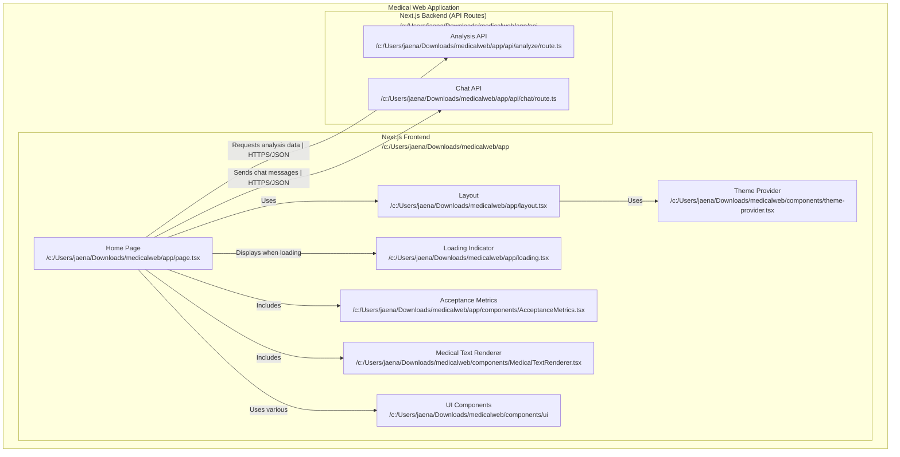

# Medical Imaging Diagnosis Agent

## Descripción del Proyecto

El Medical Imaging Diagnosis Agent es una aplicación web avanzada diseñada para asistir en el análisis preliminar de imágenes médicas utilizando inteligencia artificial a través de la API de Google Gemini. Esta herramienta permite a profesionales de la salud y estudiantes de medicina obtener un análisis inicial de imágenes médicas y mantener conversaciones contextuales sobre los hallazgos.

La aplicación combina capacidades de análisis de imágenes con un sistema de chat inteligente que mantiene el contexto de análisis previos, proporcionando una experiencia integrada para la interpretación asistida de imágenes médicas.

## Características Principales

- **Análisis de Imágenes Médicas**: Procesamiento y análisis de radiografías, resonancias, tomografías y otros tipos de imágenes médicas
- **Chat Médico Contextual**: Sistema de chat que incorpora información de análisis previos para responder consultas
- **Interfaz Responsiva**: Diseño adaptable a diferentes dispositivos y tamaños de pantalla
- **Estadísticas de Uso**: Panel de métricas para seguimiento de actividad del sistema
- **Mecanismos de Seguridad**: Filtrado de contenido inapropiado y enmascaramiento de datos sensibles
- **Despliegue Simplificado**: Configuración optimizada para despliegue en Vercel

## Requisitos Técnicos

### Requisitos de Software
- **Node.js**: Versión 18.x o superior
- **npm**: Versión 9.x o superior
- **Navegador Web**: Chrome, Firefox, Safari o Edge (versiones actualizadas)

### Dependencias Principales
- **Next.js 14**: Framework de React para renderizado del lado del servidor
- **React 18**: Biblioteca para construcción de interfaces
- **Tailwind CSS**: Framework de utilidades CSS para el diseño
- **Google Generative AI SDK**: Para interacción con la API de Gemini

### Requisitos de API
- **API Key de Google AI (Gemini)**: Necesaria para acceder a los modelos de IA de Google
  - Modelo utilizado: gemini-2.0-flash
  - [Obtener API Key](https://ai.google.dev/)

## Instalación y Configuración

### Instalación Local

1. **Clonar el repositorio**:
   ```bash
   git clone https://github.com/schnneider-utp/medicalweb2.0
   cd medicalweb2.0
   ```

2. **Instalar dependencias**:
   ```bash
   npm install
   ```

3. **Iniciar el servidor de desarrollo**:
   ```bash
   npm run dev
   ```

4. **Acceder a la aplicación**:
   Abrir [http://localhost:3000](http://localhost:3000) en el navegador

### Despliegue en Producción (Vercel)

#### Opción 1: Despliegue desde GitHub
1. Subir el código a un repositorio de GitHub
2. Iniciar sesión en [Vercel](https://vercel.com)
3. Hacer clic en "New Project"
4. Importar el repositorio de GitHub
5. Configurar variables de entorno (opcional)
6. Hacer clic en "Deploy"

#### Opción 2: Despliegue con Vercel CLI
1. Instalar Vercel CLI:
   ```bash
   npm install -g vercel
   ```

2. Navegar a la carpeta del proyecto:
   ```bash
   cd medical-web
   ```

3. Iniciar sesión en Vercel:
   ```bash
   vercel login
   ```

4. Desplegar el proyecto:
   ```bash
   vercel
   ```

5. Para producción:
   ```bash
   vercel --prod
   ```

## Guía de Uso

### Configuración Inicial
1. Al acceder por primera vez, se solicitará una API Key de Google Gemini
2. Ingresar la API Key en el campo correspondiente y hacer clic en "Guardar"
3. La API Key se almacenará localmente en el navegador para futuras sesiones

### Análisis de Imágenes
1. Seleccionar la pestaña "Análisis de Imagen"
2. Hacer clic en "Seleccionar Imagen" o arrastrar una imagen médica al área designada
3. La imagen se mostrará en la vista previa
4. Hacer clic en "Analizar Imagen"
5. El sistema procesará la imagen y mostrará un análisis estructurado con:
   - Tipo de imagen
   - Hallazgos clave
   - Evaluación diagnóstica
   - Explicación para el paciente
   - Contexto de investigación

### Uso del Chat Médico
1. Seleccionar la pestaña "Chat"
2. Escribir una consulta relacionada con la imagen analizada o cualquier otra pregunta médica
3. El sistema responderá utilizando el contexto de análisis previos cuando sea relevante
4. El historial de chat se mantiene durante la sesión

### Visualización de Estadísticas
1. Navegar a la sección de estadísticas
2. Revisar métricas de uso como número de análisis, consultas de chat, etc.

## Arquitectura del Sistema

### Componentes Principales
- **Interfaz de Usuario**: Implementada con React y Tailwind CSS
- **API Routes**: Endpoints de Next.js para procesamiento de solicitudes
- **Servicios de Seguridad**: Filtrado de contenido y enmascaramiento de datos sensibles
- **Integración con IA**: Conexión con la API de Google Gemini

### Flujo de Datos
1. El usuario sube una imagen o envía un mensaje de chat
2. La solicitud pasa por validaciones de seguridad
3. Se procesa mediante la API de Google Gemini
4. La respuesta se filtra para enmascarar datos sensibles
5. Se presenta el resultado al usuario con formato estructurado




## Seguridad y Privacidad

La aplicación implementa varias capas de seguridad:

- **Filtrado de Contenido**: Detección y bloqueo de contenido inapropiado
- **Enmascaramiento de Datos**: Protección automática de información sensible como:
  - Números de identificación (DNI, SSN)
  - Números de teléfono
  - Tarjetas de crédito
  - Direcciones de correo electrónico
  - Direcciones IP


## Limitaciones Actuales y Mejoras Futuras

### Limitaciones
- **Búsqueda de Contexto Básica**: Actualmente utiliza coincidencia simple de palabras clave
- **Sin Persistencia de Datos**: Los análisis y chats se almacenan solo en memoria durante la sesión
- **Dependencia de API Key del Usuario**: Requiere que cada usuario proporcione su propia API Key

### Mejoras Planificadas
- **Implementación de RAG (Retrieval Augmented Generation)**:
  - Generación de embeddings para análisis médicos
  - Almacenamiento en base de datos vectorial
  - Búsqueda semántica para mejor recuperación de contexto
- **Almacenamiento Persistente**: Base de datos para guardar análisis y conversaciones
- **Autenticación de Usuarios**: Sistema de login para profesionales médicos
- **Expansión de Capacidades de Análisis**: Soporte para más tipos de imágenes médicas

## Notas Importantes

- **Uso Educativo**: Esta aplicación está diseñada solo para fines educativos e informativos
- **No Diagnóstico Oficial**: Todos los análisis deben ser revisados por profesionales de la salud calificados
- **Complemento, No Sustituto**: No tomar decisiones médicas basadas únicamente en este análisis
- **Privacidad**: Las imágenes y datos se procesan en el servidor pero no se almacenan permanentemente

## Tecnologías Utilizadas

- **Frontend**: Next.js 14, React 18, Tailwind CSS
- **Backend**: API Routes de Next.js
- **IA**: Google Gemini API (modelo gemini-2.0-flash)
- **Despliegue**: Vercel
